# Microsoft Graph Alexa Connect Node Sample (SDK)
##Table of contents

* [Introduction](#introduction)
* [Prerequisites](#prerequisites)
* [Build and package the code for your skill](#build)
* [Deploy the code package for your skill](#deploy)
* [Register skill in Azure AD](#registerAppAzureAD)
* [Create the Alexa custom skill](#createSkill)
* [Run the sample](#run)
* [Questions and comments](#questions)
* [Contributing](#contributing")
* [Additional resources](#additional-resources)

<a name="introduction"></a>
## Introduction
This sample project demonstrates how to use [Amazon Alexa](https://developer.amazon.com/alexa) to send email using the [Microsoft Graph JavaScript SDK](https://github.com/microsoftgraph/msgraph-sdk-javascript) to work with data returned by Microsoft Graph. This sample creates a custom Alexa skill which will allow you to use your voice to interact with Microsoft Graph.

The sample uses the  [Azure AD v2.0 endpoint](https://graph.microsoft.io/en-us/docs/authorization/converged_auth), which enables developers to write a single code flow that handles authentication for both users' work or school (Azure Active Directory) or personal (Microsoft) accounts, including Office 365, Outlook.com, and OneDrive accounts.

Using an [Amazon Echo device](https://www.amazon.com/echo) or the [Echo Simulator](https://echosim.io) you can send an email with your voice using the command _"Alexa, ask Graph Connect to send mail"_.

<a name="prerequisites"></a>
## Prerequisites

This sample requires the following:  

  * [Amazon Developer Portal Account](https://developer.amazon.com/edw/home.html#/) 
  * [Amazon Echo Simulator running on Google Chrome](https://echosim.io)
  * [Amazon Web Service Account for AWS Lambda](http://aws.amazon.com/lambda/)
  * Either a [Microsoft](https://www.outlook.com) or [Office 365 for business account](https://msdn.microsoft.com/office/office365/howto/setup-development-environment#bk_Office365Account)

<a name="build"></a>
## Build and package the code for your skill
In this sample, the bot is written in Node.js. To prepare the code package for deployment, use the following steps to download dependencies and create a .zip file. 

###Building the Bot###

1. Download or clone the Microsoft Graph Alexa Connect Node Sample.
2. Install the dependencies by running the following command:

    ```
    npm install
    ```
    
3. Optionally, you can open the sample solution in [Visual Studio Code](https://code.visualstudio.com/) to understand the how the bot works. Visual Studio Code can be used on either Windows or a Mac. Run the following command from the terminal or command window. Note the period at the end.

	```
	code .
	```
	
4. Prepare the node package for deployment by zipping the source files. On the Mac using the terminal, run the following command from the folder containing the index.js. On Windows use the File Explorer content menu to send to a compressed folder.


  > ***Note***: The zip file will only contain the index.js and emailHelper.js at the root and the node_modules folder, which contains all the npm packages.

	```
	zip -r GraphAlexaConnectSample.zip index.js emailHelper.js node_modules/
	```
	
In the [Deploy the Skill](#deploy) section you will learn how to deploy this node zip package to a hosting provider, like AWS Lambda.

####Code Highlights#### 

- The main skill code is located in the index.js file. This contains the main entry point which is called from the Echo device. In addition to passing the intent and the slot values, the OAuth 2 bearer token will also be passed to your code on every intent. Later in the [Create the Alexa custom skill](#createSkill) section you will link the skill with Active Directory. Once the account is linked and authenticated, the bearer token will be passed on every call; you only need to provide it to the Microsoft Graph JavaScript library to make calls on the Graph.

- The sample uses the [JavaScript SDK library](https://github.com/microsoftgraph/msgraph-sdk-javascript) to make it easy to call the Microsoft Graph. The library is distributed as an npm package. 

- The emailHelper.js file helps format the message to pass to the [sendMail Graph API](https://graph.microsoft.io/en-us/docs/api-reference/v1.0/api/user_sendmail) call. 

To learn more about creating Alexa Skills vist the [Amazon Developer portal](https://developer.amazon.com/alexa-skills-kit). 

<a name="deploy"></a>
##Deploy the code package for your skill##
Now that you have the code for the skill packaged you need to deploy it to a host server. In this sample you will use [Amazon Lambda](https://aws.amazon.com/lambda) to host the node code.

  > ***Note***: If you are new to Lambda functions you can follow these more detailed steps for [Creating an AWS Lambda Function for a Custom Skill](https://developer.amazon.com/public/solutions/alexa/alexa-skills-kit/docs/developing-an-alexa-skill-as-a-lambda-function).
  
1. Login to the [AWS Management Console for Lambda](https://console.aws.amazon.com/lambda).
2. Click **Create a Lambda Function** to create a new function.
3. On the **Select a Blueprint** step, Click **Blank Function** to skip using a Blueprint.
4. Create a Trigger by clicking on the dotted square. Choose **Alexa Skills Kit** from the dropdown menu.

  

5. Click **Next** to configure the Lambda Function.
6. Configure the function. Set the **Name** property to *AlexaNodeConnectSample*. Set the **Description** to *Microsoft Graph and Alexa Connect Sample*. Keep the default value for the Runtime of Node.js 4.3 or the latest version.

  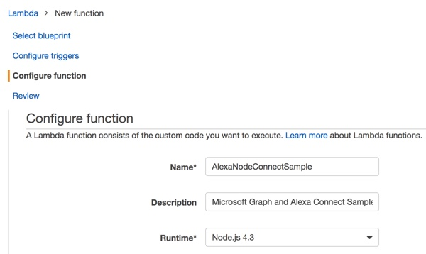

7. In the **Lambda function code** section you will Upload the code package. Set the **Code entry type** drop down to **Upload a .Zip** file in the . Upload the GraphAlexaConnectSample.zip file you created in the [Building the Bot](#build) section by clicking on the Upload button. 

  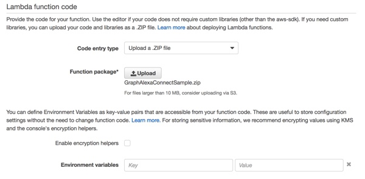

8. Select a function handler and role to use the basic execution role. Set the handler to index_handler.

  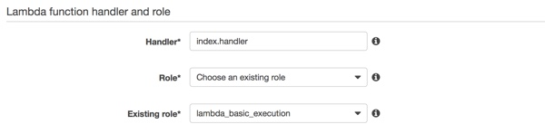

9. Leave the remaining fields set to thier default values.
10. Click **Next** to review the Lambda Function. 
11. Review the Lamdba settings. Click **Create function** to create the Lambda function. This step also creates the Amazon Resource Name (ARN). The ARN is an internal reference to the Lambda function. Make note of the ARN, you will use it later in the [Create the Alexa custom skill](#createSkill) section you will section.

  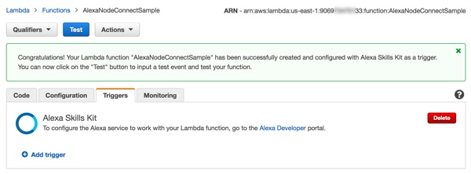

For more detailed steps see [Creating the Lambda Function](https://developer.amazon.com/public/solutions/alexa/alexa-skills-kit/docs/developing-an-alexa-skill-as-a-lambda-function).

<a name="registerAppAzureAD"></a>
## Register skill in Azure AD

Register your Alexa skill as a converged application on the **Microsoft Application Registration Portal**. Converged applications enable user to authenticate with either a Microsoft account (MSA) or an Azure Active Directory (AAD) account.

1. Sign into the [Application Registration Portal](https://apps.dev.microsoft.com/) using either your personal, work or school account.
2. Click **Add an app** in the **Converged application** section on the **My applications** page.
3. On the **New Application Registration** dialog, enter a name for the app, for example _alexa-node-connect-rest-sample_.
4. Click **Create application** to register the application.

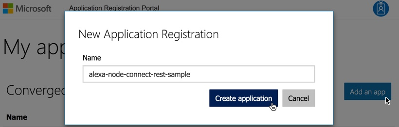

The application page will show all of the properties and options for your new application registration.

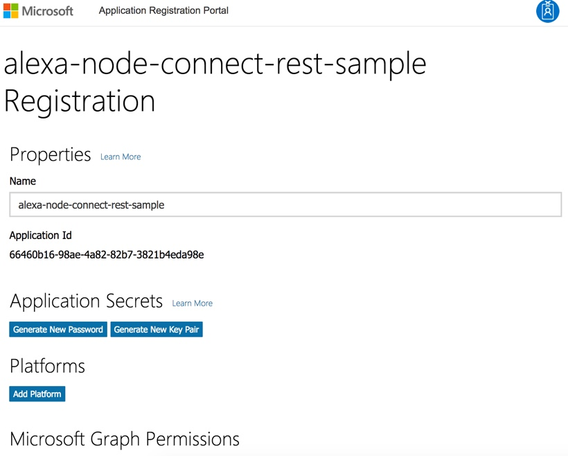

4. Under **Platforms**, click **Add platform**.
5. Click **Web**.

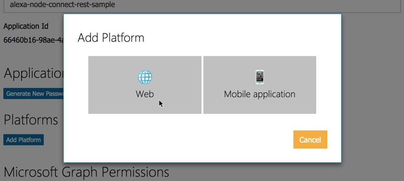

6. Enable **Allow Implicit Flow**.
7. Under **Redirect URIs**, enter the first redirect URL, **https://amazon.com**. In a later step from the Alexa skill portal, you will retrieve the other two redirect URLs from the **Redirect URLs** field.  The URLs will be in a format similar to these: _https://pitangui.amazon.com/api/skill/link/MOV... and https://layla.amazon.com/api/skill/link/MOV... . 

  > ***Note***: Currently, there is a temporary limitation with Azure AD where you also need to add the root domain, in this case https://amazon.com, if your redirect URLs use a subdomains. Read more details about [Azure AD v2 endpoints](https://docs.microsoft.com/en-us/azure/active-directory/develop/active-directory-v2-limitations#restrictions-on-redirect-uris) and redirect URL retrictions.

  > ***Note***: The redirect URLs are located on your Alexa skill page's **Configuration** section under **Account Linking**. The Alexa Skill provides 2 URLs. You will need to add both URLs, one is for North American devices and one is for European devices. Once you create your skill later, remember to return and replace the temporary redirect URL with the actual ones. 
  
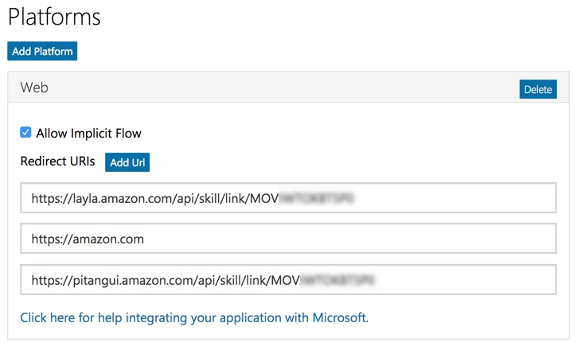  

8. Click **Save**

  > **Note:** Make a note of your application ID and secret for use later in the [Account Linking](#accountlinking) section.  
  a. Copy the **Application Id** value and paste it into the **Client Id** field in the Alexa skill portal.  
  b. Select **Generate New Password** to create a secret. The password generated will only be displayed once so be sure to copy it immediately. Paste the generated password into the Authorization Grant Type **Client Secret** field in the Alexa skill portal.  

<a name="createSkill"></a>
## Register and configure the Alexa custom skill

There are a number of steps to register a custom skill. For more details, see the [Alexa Skills Kit](https://developer.amazon.com/alexa-skills-kit) documentation.

1. Open the [Alexa Skills List](https://developer.amazon.com/edw/home.html#/skills/list) Page. This page will list your skills. 
2. Click the **Add a New Skill** button.

### Skill Information

The **Create a New Alexa Skill** page has a number of sections that you will fill out to create your Alexa Skill. Enter the following values for the **Skill Information** section:

1. **Skill Type** set to Custom Interaction Model.
2. **Language** set to English (U.S.).
3. **Name** set this to Graph Connect Skill or any name you prefer.
4. **Invocation Name** set to _Graph Connect_ or your own name following the [Invocation Name Guidelines](https://developer.amazon.com/appsandservices/solutions/alexa/alexa-skills-kit/docs/choosing-the-invocation-name-for-an-alexa-skill).
5. **Global Fields Audio Player** set to No.
6. Select **Next** to go to the **Interaction Model** section.

Here is what the fields will look like when they are filled in.

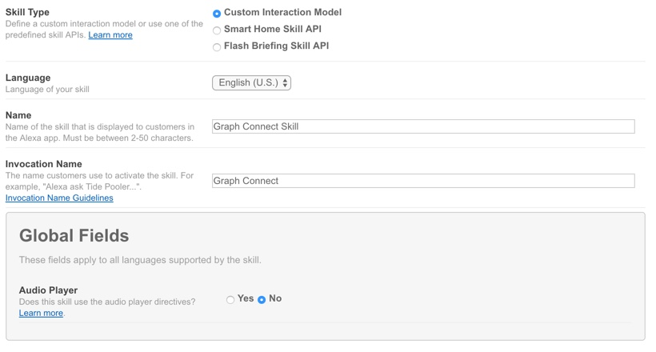

### Interaction Model

Enter the following values for the **Interaction Model** section:

1. Enter the Intent Schema. The Intent Schema defines the intents, or functions, that your skill supports. In the case of this sample there is only one intent called the sendMailIntent. Enter the follow text into the **Intent SChema** field. You can also find the intent schema text file in the source code for this sample located in the /speechAssets/intents.json file.

```JSON
{
  "intents": [
    {
      "intent": "SendMailIntent"
    }
  ]
}
```
Here is what the field will look like when is is filled in.

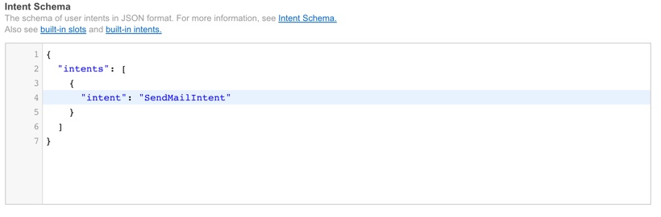

2. There are no **Custom Slot Types**.
3. Enter the Sample Utterances. The Sample Utterances are examples of what the user will say to invoke your skill. These are used to train the Amazon Voice Services (AVS) to map the utterance to the intent. Enter the follow text inthe the **Sample Utterance** field. You can also find the sample utterances text file in the source code for this sample located in the /speechAssets/Utterances.txt.

```
SendMailIntent send mail
SendMailIntent send me mail
SendMailIntent send mail to myself
SendMailIntent send a test message
SendMailIntent send a test message to myself
```
Here is what the field will look like when is is filled in.

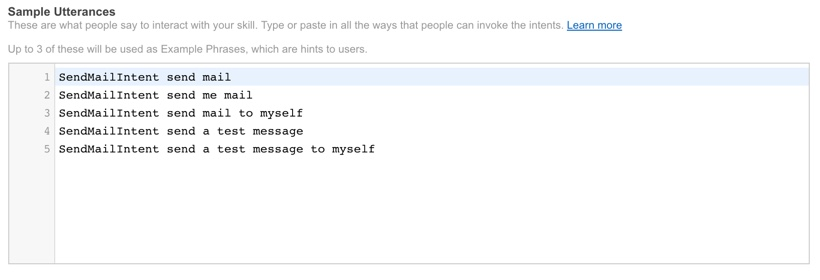

4. Select **Next** to go to the **Configuration** section.

<a name="configuration"></a>
### Configuration
The Configuration section is where you will define 2 important parts of your skill, the EndPoint and the Linked Account. 

#### Endpoint
The **EndPoint** is a URL reference to the code for your skill. In this sample you will use Amazon's Lambda to host the code, but this can also be hosted on any HTTPS reachable endpoint.

1. Set the **Service Endpoint Type** to AWS Lambda ARN (Amazon Resource Name). You can also choose HTTPS if you would like to host your skill code on Microsoft Azure. For this sample you will use AWS. An Azure step-by-step readme will follow in the near future.
2. Set the **AWS Lambda ARN** to North America.
3. Set the ARN to your Lambda function. Enter the ARN from your Lambda function that you created earlier.  

  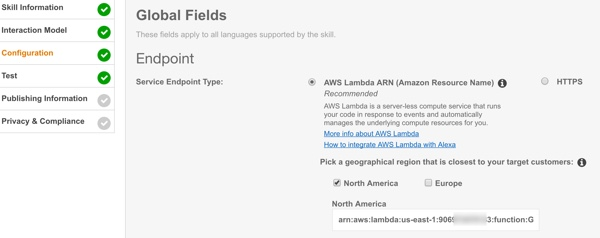

<a name="accountlinking"></a>
#### Account Linking

Authentication for Alexa skills are handled using account linking. When your skill is enabled the user will execute the OAuth 2.0 authentication flow in the browser. The security tokens will be managed by Amazon. When your skill is invoked, the authentication token will be passed to your skill code.

1. Select **Yes** to: **Do you allow users to create an account or link to an existing account with you?**

  > ***Note***: At this point you will need to jump out to the [Register an application](#registerApp) section of this readme. You will basically need to do these two sections in parallel. Open a new browser window to make it easy to switch back and forth.


2. Set **Authorization URL** to _https://login.microsoftonline.com/common/oauth2/v2.0/authorize_
3. **Client Id** will be the value of your **Application Id** from the Microsoft Application Registration Portal, as described in the [Register an application](#registerApp) section.
4. Enter URLs for each domain in your authentication flow. For example here are the ones to login in using my corporate credentials or my Microsoft Account (MSA),like hotmail, credentials. I have also included the URLs for the Chinese and German Azure datacenters. If you are using a custom domain you will need to add those as well. Enter the following domain URLs for the whitelist.
	- login.live.com
	- login.windows.net
	- login.microsoftonline.com
	- login-us.microsoftonline.com
	- login.chinacloudapi.cn
	- login.microsoftonline.de
	- msft.sts.microsoft.com

	
5. For **Scope**, add the following scopes.
	- **offline_access** - This tells Azure AD to return a refresh token. This is required for all skills regardless of what other scopes are required. 
	- **user.read** - read-only access to the user profile.
	- **mail.read** - read-only access to read mail.
	- **mail.send** - permission to send mail.

6. Copy a Redirect URL into your Azure AD skill registion that you completed earlier. 
6. Set **Authorization Grant Type** to _Auth Code Grant_.
7. Set **Access Token URI** to _https://login.microsoftonline.com/common/oauth2/v2.0/token_
8. The **Client Secret** will be the secret generated in the [Register an app in Azure AD](#registerApp) section.
9. Set the **Client Authentication Scheme** to _Credentials in the request body_. 

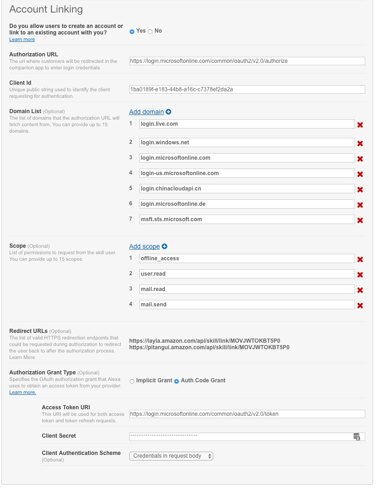

10. Enter a **Privacy Policy URL**. For example you can use _https://privacy.microsoft.com/en-us/privacystatement_ as a placeholder for the sample.
11. Click **Next** to go to the Test section.

  > ***Note***: Your skill is ready to test, jump ahead to the  [Test](#test) section of this readme. 

<a name="LinkAccount"></a>
## Link your Account
Once you enable account linking on your skill you will need to enable the skill and link the account. This can be done on either the [Alexa app](https://www.amazon.com/gp/help/customer/display.html?nodeId=201602060) for iOS, Android, or the web.

1. Open the web [Alexa App http://alexa.amazon.com](http://alexa.amazon.com/spa/index.html#cards).
2. Click on **Skills** on the left menu to open the Alexa Skills store.
3. Click on **Your Skills** on the top right to list just the skills you have  enabled.
4. Browse the list of your skills and click on the **Graph Connect** skill. 

<a name="test"></a>
## Test the sample

You can test your custom skill from within the Alexa skill developer console. This will enable you to see the actual request and response to your service.

  > ***Note***: Before you can test you will need to [link your account](#LinkAccount) section of this readme. If you have not already created the zip package to deploy your code, do this step now.

1. Select the **Test** tab.
2. Set the **Enter Utterance** field to "send mail".
3. Select **Ask Graph Connect Skill** to make the request.

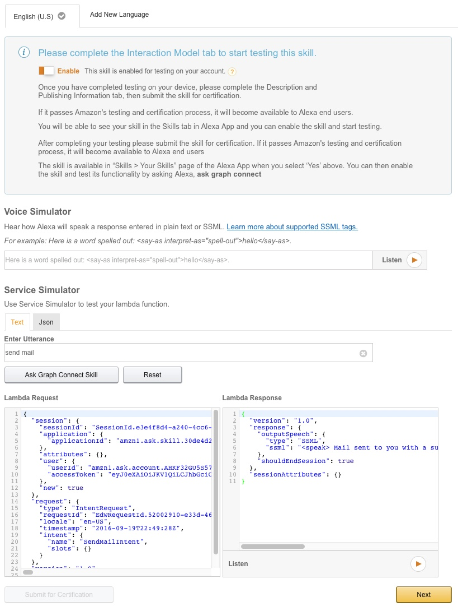


<a name="run"></a>
## Run the sample in the Echo simulator

After you have verified that everything is working in the Amazon developer console, you can test it on an actual Amazon Echo device or using the Echo simulator. 

If you are using an actual Echo device that is registered using the same account as your developer account then it is already available. Say "Alexa, ask Graph Connect to send mail." 

If you are using the simulator use the following steps:  
1. Open https://echosim.io/.
2. Select **Login with Amazon** and login with the same account you are using to develop the sample.
3. Wait for the simulator to indicate it's ready. 
4. Click and hold the microphone icon and say **"ask Graph Connect to send mail"**. 

> Note: The simulator only works with a limited number of browsers like Chrome.


<a name="questions"></a>
## Questions and comments

We'd love to get your feedback about the Microsoft Graph Alexa Connect Node Sample. You can send your questions and suggestions to us in the [Issues](https://github.com/MicrosoftGraph/nodejs-alexa-connect-sample/issues) section of this repository.

Your feedback is important to us. Connect with us on [Stack Overflow](https://stackoverflow.com/questions/tagged/office365+or+microsoftgraph). Tag your questions with [MicrosoftGraph].

<a name="contributing"></a>
## Contributing

If you'd like to contribute to this sample, see [CONTRIBUTING.MD](/CONTRIBUTING.md).

This project has adopted the [Microsoft Open Source Code of Conduct](https://opensource.microsoft.com/codeofconduct/). For more information see the [Code of Conduct FAQ](https://opensource.microsoft.com/codeofconduct/faq/) or contact [opencode@microsoft.com](mailto:opencode@microsoft.com) with any additional questions or comments.


<a name="additional-resources"></a>
## Additional resources

- [Other Microsoft Graph Connect samples](https://github.com/MicrosoftGraph?utf8=%E2%9C%93&query=-Connect)
- [Microsoft Graph overview](https://graph.microsoft.io)


## Copyright
Copyright (c) 2016 Microsoft. All rights reserved.


